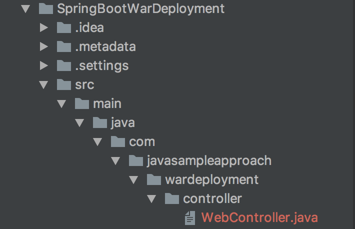
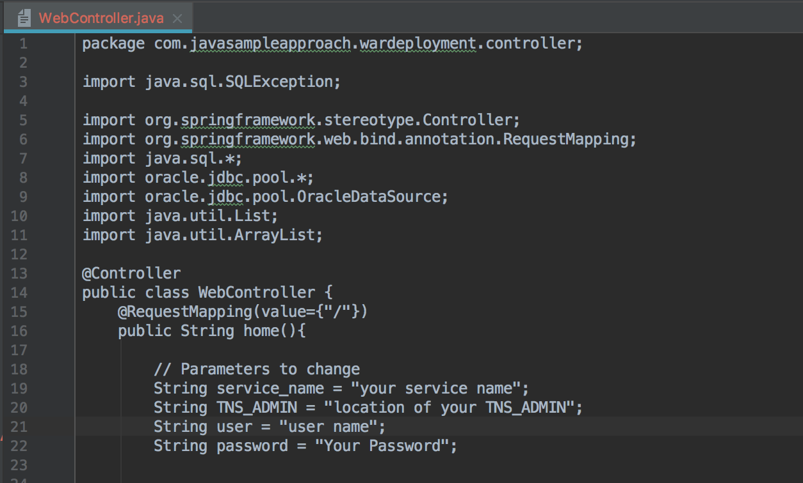

Updated: December 10, 2018

## Introduction

This lab guide will walk you through the process of setting Spring Boot Application as per your Autonomous Environment. 

**_To log issues_**, click here to go to the [github oracle](https://github.com/oracle/learning-library/issues/new) repository issue submission form.

## Objectives

- Set up instant client with Autonomous Database Wallet.
- Set up environment parameters in Spring Boot Application. 

## Required Artifacts

- An oracle cloud account with Autonomous Data Warehouse Cloud Service.

### **STEP 1**: Set up instant client with Autonomous Database Wallet.  

- Download Client Credentials (Wallets): Please follow this link to download the wallet: https://docs.oracle.com/en/cloud/paas/autonomous-data-warehouse-cloud/user/connect-download-wallet.html#GUID-B06202D2-0597-41AA-9481-3B174F75D4B1

- Download Instant Client - "Basic Package - All files required to run OCI, OCCI, and JDBC-OCI applications" from the following link: https://www.oracle.com/technetwork/topics/intel-macsoft-096467.html. 
NOTE: You need to accept the agreement first before downloading the package.  Unzip the file.

- Unzip the Autonomous wallet downloaded, and navigate to sqlnet.ora. 
  Edit sqlnet.ora as follows:

    nano sqlnet.ora

    WALLET_LOCATION = (SOURCE = (METHOD = file) (METHOD_DATA = (DIRECTORY=**$TNS_ADMIN**)))
    SSL_SERVER_DN_MATCH=yes
    
- Set LD_LIBRARY_PATH. Type the following command in your command prompt:
    
    **export LD_LIBRARY_PATH=Path of your instant client folder:$LD_LIBRARY_PATH**
    
    Note: Repeat this everytime you restart the laptop. Or add the above command in your ~/.bash_profile.
    
- Set env variables TNS_AMDIN to point to the wallet folder. Type the following command in your command prompt:
    
    **export TNS_ADMIN=Path of your unzipped wallet file**

    Note: Repeat this everytime you restart the laptop. Or add the above command in your ~/.bash_profile.

### **STEP 2**: Set up environment parameters in Spring Boot Application. 

- Unzip the downloaded Spring Boot application and navigate to the WebController.java file:

    

- Change the following paramerters in WebController.java:

    . Service name: Your Service name.
    . TNS_ADMIN: Path of the TNS_ADMIN that you have set. 
    . User: username
    . Password: Password
    
    

- Download ojdbc8-full.tar.gz fromt he following site: https://www.oracle.com/technetwork/database/features/jdbc/jdbc-ucp-122-3110062.html
  Unzip it and note down the location of ojdbc8.jar file alonf with the file name.
  
- Navigate to the SpringBootWarDeployment directory where the pom.xml file is located.

    

- Make sure that you have the Maven installed. If not, follow the following link:
  https://maven.apache.org/install.html
  
- Change the location of ojdbc8.jar in the following command and run it:

  **mvn install:install-file -Dfile=location of ojdbc8.jar -DgroupId=com.github.noraui -DartifactId=ojdbc8 -Dversion=12.2.0.1 -Dpackaging=jar -DgeneratePom=true**
  

Youa re all set to go to the next lab.
